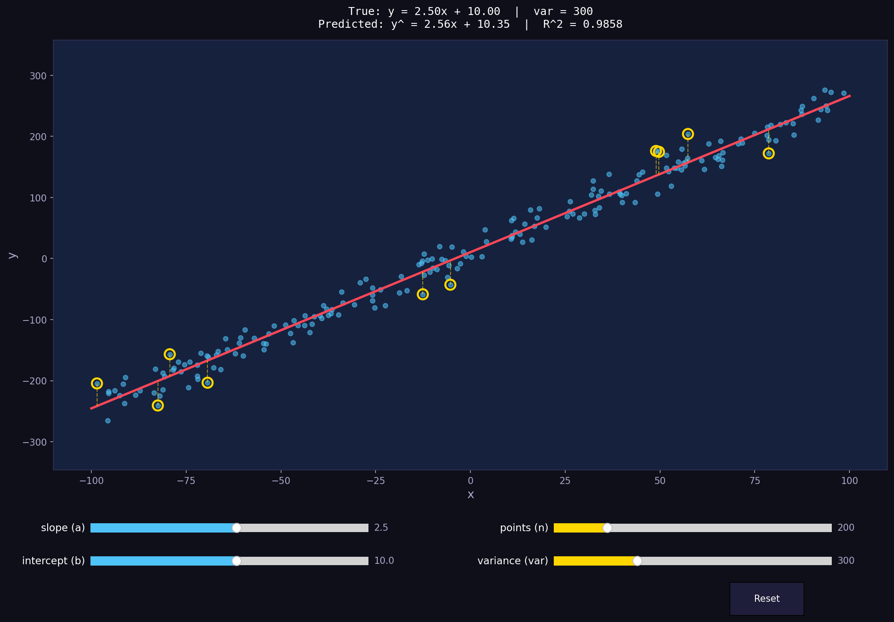

# NCHU Linear Regression

Interactive linear regression visualization built with Python, matplotlib, and scikit-learn.

demo page: https://nchu-linear-regression-uspll643kdgiggghrcszjn.streamlit.app/

## Screenshot



## Features

- Real-time control of linear regression parameters via sliders
- Adjustable true **slope (a)** and **intercept (b)**
- Adjustable number of data **points (n)** and noise **variance (var)**
- Highlights the top 10 outliers with residual drop lines
- Displays true equation vs predicted equation and R² score
- Reset button to restore defaults

## Requirements

- Python 3.8+
- numpy
- matplotlib
- scikit-learn

## Installation
hhhhhhhhhhhhhhhhhh
```bash
pip install numpy matplotlib scikit-learn
```

## Usage

```bash
python linear_regression_interactive.py
```

### Controls

| Slider | Description | Default |
|--------|-------------|---------|
| slope (a) | True slope of y = ax + b | 2.5 |
| intercept (b) | True intercept of y = ax + b | 10 |
| points (n) | Number of data points | 200 |
| variance (var) | Noise variance | 300 |
| **Reset** | Reset all sliders to defaults | — |

The plot updates in real-time as you drag any slider. Gold circles mark the top 10 outliers (largest residuals), with dashed lines showing the vertical distance to the regression line.
